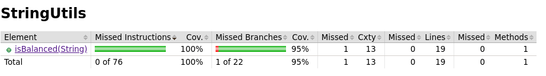
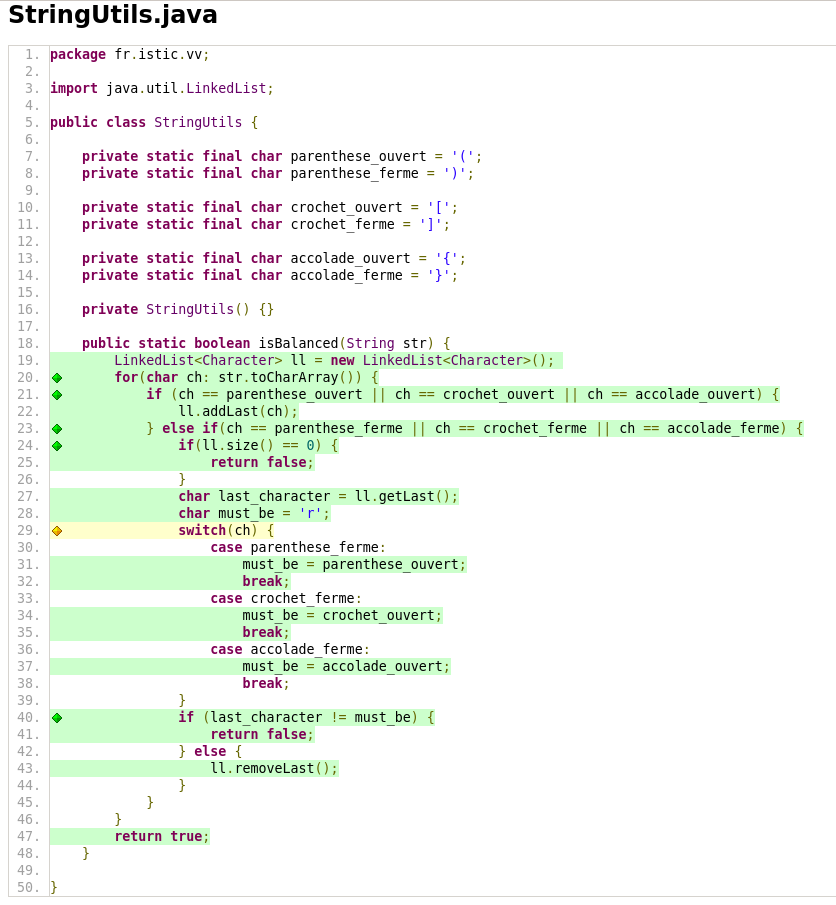
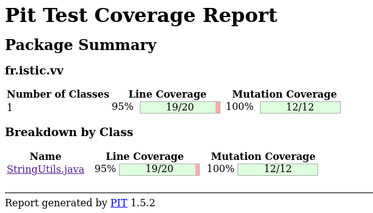

# Balanced strings

A string containing grouping symbols `{}[]()` is said to be balanced if every open symbol `{[(` has a matching closed symbol `]}` and the substrings before, after and between each pair of symbols is also balanced. The empty string is considered as balanced.

For example: `{[][]}({})` is balanced, while `][`, `([)]`, `{`, `{(}{}` are not.

Implement the following method:

```java
public static boolean isBalanced(String str) {
    ...
}
```

`isBalanced` returns `true` if `str` is balanced according to the rules explained above. Otherwise, it returns `false`.

Use the coverage criteria studied in classes as follows:

1. Use input space partitioning to design an initial set of inputs. Explain below the characteristics and partition blocks you identified.
2. Evaluate the statement coverage of the test cases designed in the previous step. If needed, add new test cases to increase the coverage. Describe below what you did in this step.
3. If you have in your code any predicate that uses more than two boolean operators check if the test cases written so far satisfy *Base Choice Coverage*. If needed add new test cases. Describe below how you evaluated the logic coverage and the new test cases you added.
4. Use PIT to evaluate the test suite you have so far. Describe below the mutation score and the live mutants. Add new test cases or refactor the existing ones to achieve a high mutation score.

Write below the actions you took on each step and the results you obtained.
Use the project in [tp3-balanced-strings](../code/tp3-balanced-strings) to complete this exercise.

## Answer
First thing, there is my code for the function `isBalancedString()`:
```java
public static boolean isBalanced(String str) {
        LinkedList<Character> ll = new LinkedList<Character>(); 
        for(char ch: str.toCharArray()) {
            if (ch == parenthese_ouvert || ch == crochet_ouvert || ch == accolade_ouvert) {
                ll.addLast(ch);
            } else if(ch == parenthese_ferme || ch == crochet_ferme || ch == accolade_ferme) {
                if(ll.size() == 0) {
                    return false;
                }
                char last_character = ll.getLast();
                char must_be = 'r';
                switch(ch) {
                    case parenthese_ferme:
                        must_be = parenthese_ouvert;
                        break;
                    case crochet_ferme:
                        must_be = crochet_ouvert;
                        break;
                    case accolade_ferme:
                        must_be = accolade_ouvert;
                        break;
                }
                if (last_character != must_be) {
                    return false;
                } else {
                    ll.removeLast();
                }
            }
        }
        return true;
    }
```


1. First, we have the empty String test where the function must return True. Then, we have 3 characteristics, these are `[]`, `{}` and `()`. We have one block for each characteristics where they are alone. For example we have block one where we test only the `[]` and `][`. The first one is right but the last is false, moreover the last example test also when the first symbol is a close symbol. Furthermore, we have one more block for combinaison of characteristics, `[{()}]` and his false version `[{{()}]`. And the final version is when we have the same number of closed and opened symbo but the result is false, `([)]`.
2. We used the librairy Jacoco to know the statement coverage of our function, so we add the library in the pom. To obtain the report from jacoco needs 3 steps:
    1. `sudo mvn clean install` we launch the programm and run the test
    2. `sudo mvn jacoco:prepare-agent` we prepare the data for the jacoco's report
    3. `sudo mvn jacoco:report` we create the report 
We obtain a 100% coverage:

We can see than we have *only* 95% for the branchs coverage. The resaon behind this number is the `switch`, my tests never reach the default case but always one of three declared cases. We can't create test for this branch because we have the prior `if` that works as filter. Like we can see on this image:

3. 
4. The Pit plugin was already in the `pom.xml`. So to have the report from **PIT** we just need to run `sudo mvn test-compile org.pitest:pitest-maven:mutationCoverage`. After this command, we can found the report in the folder *Target*. We obtain this:

We have 100% on mutation coverage.


[Pit plugin maven](https://pitest.org/quickstart/maven/)
