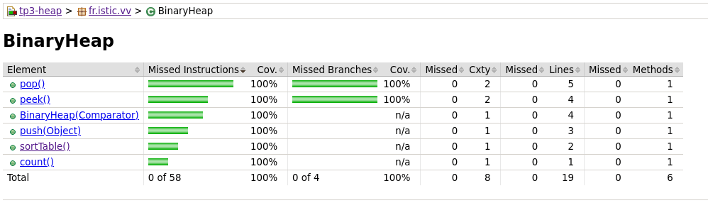
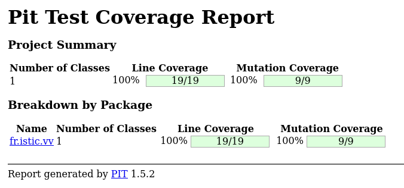

# Implementing and testing a binary heap

A [*binary heap*](https://en.wikipedia.org/wiki/Binary_heap) is a data structure that contains comparable objects and it is able to efficiently return the lowest element.
This data structure relies on a binary tree to keep the insertion and deletion operations efficient. It is the base of the [*Heapsort* algorithm](https://en.wikipedia.org/wiki/Heapsort).

Implement a `BinaryHeap` class with the following interface:

```java
class BinaryHeap<T> {

    public BinaryHeap(Comparator<T> comparator) { ... }

    public T pop() { ... }

    public T peek() { ... }

    public void push(T element) { ... }

    public int count() { ... }

}
```

A `BinaryHeap` instance is created using a `Comparator` object that represents the ordering criterion between the objects in the heap.
`pop` returns and removes the minimum object in the heap. If the heap is empty it throws a `NotSuchElementException`.
`peek` similar to `pop`, returns the minimum object but it does not remove it from the `BinaryHeap`.
`push` adds an element to the `BinaryHeap`.
`count` returns the number of elements in the `BinaryHeap`.

Design and implement a test suite for this `BinaryHeap` class.
Feel free to add any extra method you may need.

Use the following steps to design the test suite:

1. With the help of *Input Space Partitioning* design a set of initial test inputs for each method. Write below the characteristics and blocks you identified for each method. Specify which characteristics are common to more than one method.
2. Evaluate the statement coverage of the test cases designed in the previous step. If needed, add new test cases to increase the coverage. Describe below what you did in this step.
3. If you have in your code any predicate that uses more than two boolean operators check if the test cases written to far satisfy *Base Choice Coverage*. If needed add new test cases. Describe below how you evaluated the logic coverage and the new test cases you added.
4. Use PIT to evaluate the test suite you have so far. Describe below the mutation score and the live mutants. Add new test cases or refactor the existing ones to achieve a high mutation score.

Use the project in [tp3-heap](../code/tp3-heap) to complete this exercise.

## Answer
1. For the constructor, there is only one characteristic. Which is `Comparator<T> comparator`, this method can't be tested alone. The characteristic is common with the methods pop and peek. Moreover the method `push` has the characteristic `T element` which is also common with the methods pop and peek and the constructor.`count()` has the characteristics "number of time we call push - number of time we call pop" because each time we call push, we increase by 1 and for pop we decrease by 1 if the heap isn't empty.
So for `count`, we have when the heap is empty, when we call pop/peek when the hep is empty, when we call only push several times and when we call push and pop/peek several time.
So for `pop` and `peek` we have to test with the element `Comparator<T> comparator`, when we call pop/peek when the hep is empty, when we have only one element, when we have several elements.
2. We run the agent of jacoco, and we obtain 100% on both metrics. `sortTable()` is a private method which is executed while we call `push()`. We test this function while we push several elements which are not sorted and we pop the first element to compare it with the result we want.



3. In the test coverage we don't have a test which comports two boolean operation. Each test evaluate one block of our input space partition.
4. For the PIT we have also 100% on the both metrics. Indeed, every lines and branchs of the class is executed while we run the tests.


