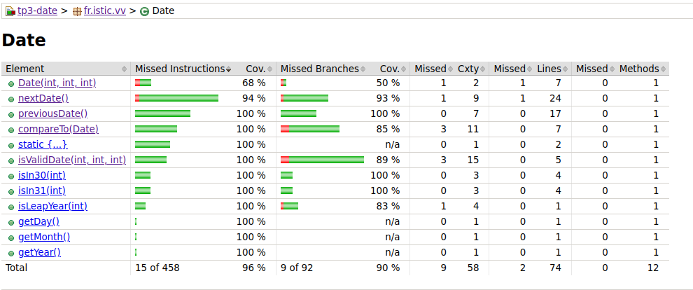
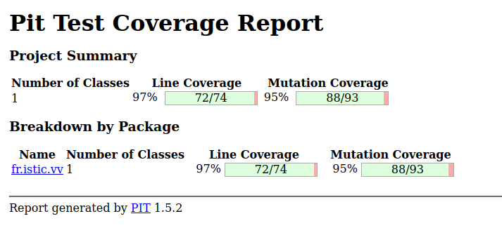

# Test the Date class

Implement a class `Date` with the interface shown below:

```java
class Date implements Comparable<Date> {

    public Date(int day, int month, int year) { ... }

    public static boolean isValidDate(int day, int month, int year) { ... }

    public static boolean isLeapYear(int year) { ... }

    public Date nextDate() { ... }

    public Date previousDate { ... }

    public int compareTo(Date other) { ... }

}
```

The constructor throws an exception if the three given integers do not form a valid date.

`isValidDate` returns `true` if the three integers form a valid year, otherwise `false`.

`isLeapYear` says if the given integer is a leap year.

`nextDate` returns a new `Date` instance representing the date of the following day.

`previousDate` returns a new `Date` instance representing the date of the previous day.

`compareTo` follows the `Comparable` convention:

* `date.compareTo(other)` returns a positive integer if `date` is posterior to `other`
* `date.compareTo(other)` returns a negative integer if `date` is anterior to `other`
* `date.compareTo(other)` returns `0` if `date` and `other` represent the same date.
* the method throws a `NullPointerException` if `other` is `null` 

Design and implement a test suite for this `Date` class.
You may use the test cases discussed in classes as a starting point. 
Also, feel free to add any extra method you may need to the `Date` class.


Use the following steps to design the test suite:

1. With the help of *Input Space Partitioning* design a set of initial test inputs for each method. Write below the characteristics and blocks you identified for each method. Specify which characteristics are common to more than one method.
2. Evaluate the statement coverage of the test cases designed in the previous step. If needed, add new test cases to increase the coverage. Describe below what you did in this step.
3. If you have in your code any predicate that uses more than two boolean operators check if the test cases written to far satisfy *Base Choice Coverage*. If needed add new test cases. Describe below how you evaluated the logic coverage and the new test cases you added.
4. Use PIT to evaluate the test suite you have so far. Describe below the mutation score and the live mutants. Add new test cases or refactor the existing ones to achieve a high mutation score.

Use the project in [tp3-date](../code/tp3-date) to complete this exercise.

## Answer

1. In this class, we had 5 function to test : isValidDate, isLeapYear, nextDate, previousDate and compareTo. 

isValidDate : Several case here. The year, month and day can't be negative, the days cannot exceed 30 or 31 depending on the month. Also the month of February is special. There can be no more than 28 days when the year is not a leap year. So there are several cases. So we followed the input space partitioning method and came up with 6 test cases (explained in the textbook).

isLeapyear : We have only one block for the year. We created 4 case : year is negative, year equal zero, year is a leap year and year is not a leap year. Therefore, we created 4 test cases.

nextDate: We have created different test cases according to different scenarios: 31 December, 28 February bisextile/non-bistextile year, 29 February bisextile year or when the month ends.

previousDate: we did like in the nextDate method but we looked at the beginning of the month.

compareTo : No particular issue here.

2. We use Jacoco to evaluate the coverage of the class. We added several test to obtain the higher coverage rate. The last remaining percentages come from the constructor, which is not tested.
 
 
 
 
 
 4. We run the command `sudo mvn test-compile org.pitest:pitest-maven:mutationCoverage` like we did in the previous exercise and we obtain :



